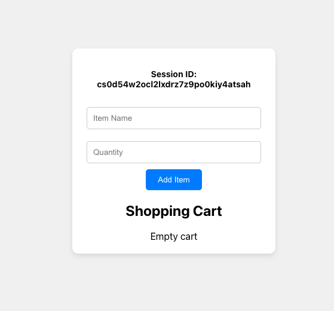
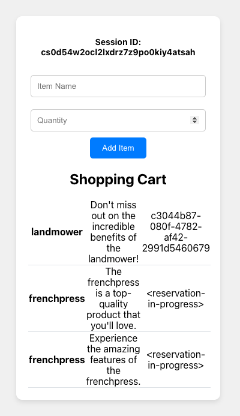
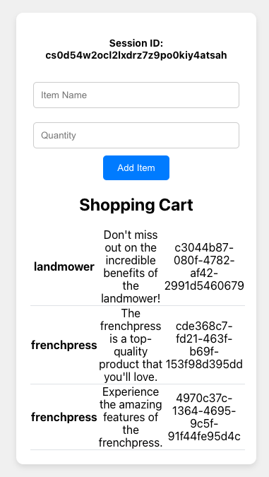

# Comments

### Design choices
- Shopping carts will be associated to the **session id** (which is used as the primary key)
- Celery task is set up to handle the (slow) external reservation calls, without hindering the endpoint response time
- The API returns a placeholder reservation id `<reservation-in-progress>` for reservations that are still in progress
- If external reserve call fails, the item is auto-deleted from the cart in the background
- Copies of the same item are considered as standalone rows (due to different reservation ids, given that we assume that external reservation only accepts one item at a time)
- Included a very simple React frontend
- At most 10 item copies can be added at the same time
- Tests included for most important uses cases

### Shortcuts taken to save time
- Did not set up docker for the project
- Used sqlite instead of a production-ready db such as postgres
- Code has baked-in mocking of the external reserve call, and of fetching item descriptions
- The payload received by the endpoint is not validated

### Obvious missing features
- For real use, carts should have an expiration time. Another Celery task could be set for this
- For real use, another endpoint should be set up to delete / un-reserve items

# Visual example






# How to run

### Backend
- Start redis: e.g. `brew services start redis`
- Start celery: e.g. `celery -A unnamedproject worker --loglevel=info`
- Run migrations: e.g. `python3 manage.py migrate`
- Run Django project: e.g. `python3 manage.py runserver`
- Create admin superuser to examine the db: e.g. `python3 manage.py createsuperuser` or use existing one (`admin`, pw `admin`)
- Access the db: `http://127.0.0.1:8000/admin/`
- Call the endpoint: 
    ```
    curl -X POST http://127.0.0.1:8000/shopping/items/ \
    -H "Content-Type: application/json" \
    -H "Cookie: sessionid=test-session-id" \
    -d '{"name": "dog", "quantity": 2}'
    ```

### Tests
- `python3 manage.py test shopping.tests`

### Frontend
- `cd frontend`
- `npm start`
- Access the frontend `http://localhost:3000/`


# Prerequisities
- Python [3.10]
- Django
- Celery
- Redis

### Optional for frontend
- Npm
- React
- Axios
